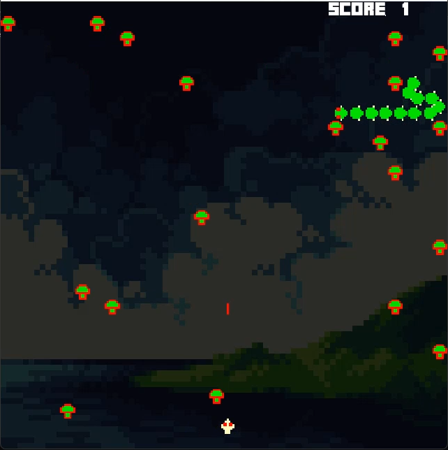
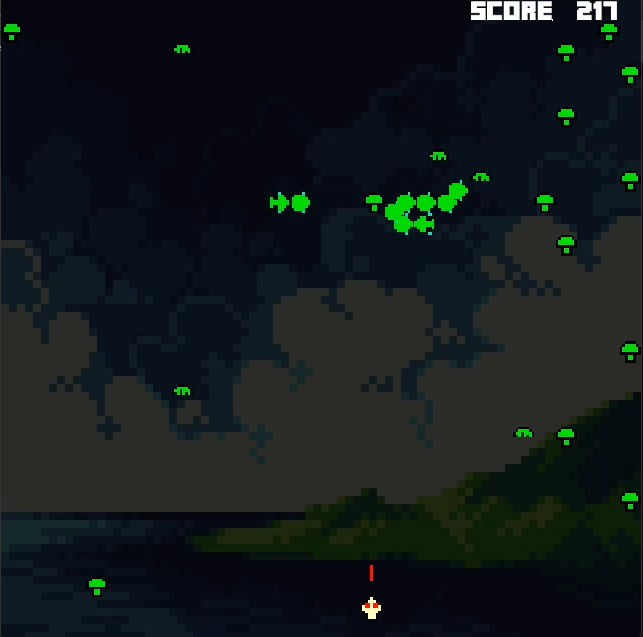
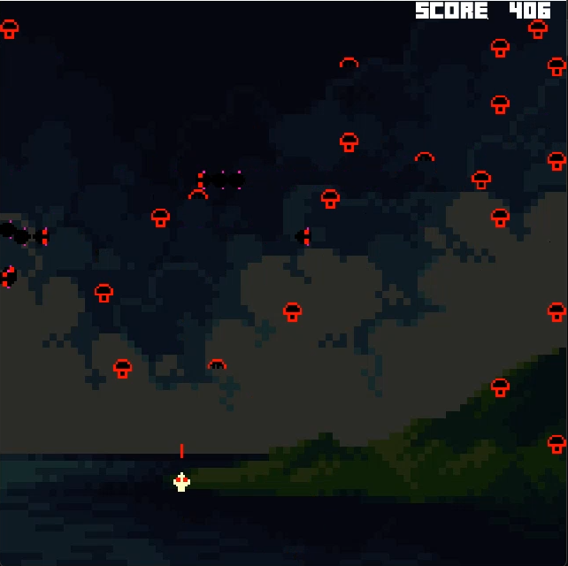
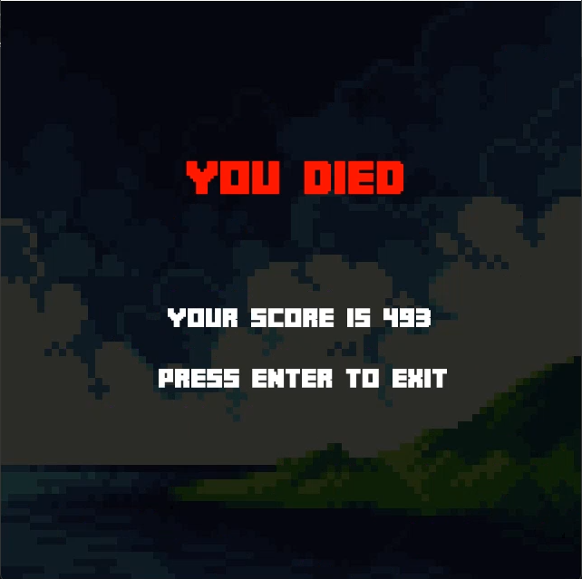

# 🎮 Centipede Game

My first ever programming project! A classic-style Centipede arcade game built using SFML in C++. Created as part of the Programming Fundamentals coursework at FAST NUCES.

## 🕹️ Features

- Centipede segments that split and grow
- Mushroom field obstacles
- Shooting and movement mechanics
- Poison mushrooms for destroyed centipede segments in player area
- Killing of the entire centipede chain upon shooting the head (Level 1 only)
- Collision detection (bullets vs. centipede, centipede vs. mushrooms, player vs centipede, player vs mushroom)
- Score tracking and game over conditions

## 📸 Screenshots





## 🛠️ Getting Started
### Requirements
- C++17 compatible compiler (e.g., g++)
- SFML 2.6.2

### How to Run
1. Clone the repository  
   ```bash
   git clone https://github.com/fhd-fsl/Centipede-Game.git
   cd Centipede-Game
   
2. Install SFML 2.6.2:
- Download SFML 2.6.2 from the [official SFML website](https://www.sfml-dev.org/download/sfml/2.6.2/)
- Extract the files and setup your environment
- Watch [this video](https://www.youtube.com/watch?v=lFzpkvrscs4) for step by step installation
- Alternatively you can use this command for manual linking (Assuming you extracted the SFML files to "C:/SFML")
  ```bash
  g++ -std=c++17 -I C:\SFML\include centipede.cpp -o centipede.exe -L C:\SFML\lib -lsfml-graphics -lsfml-window -lsfml-system -lsfml-audio
  ```

💡 Make sure:
1- C:\SFML\bin is in your PATH (or copy DLLs to your .exe folder)
2- Your compiler version matches the SFML build (e.g. GCC 11.2.0)

3- Run the game
  ```bash
  centipede.exe
  ```
